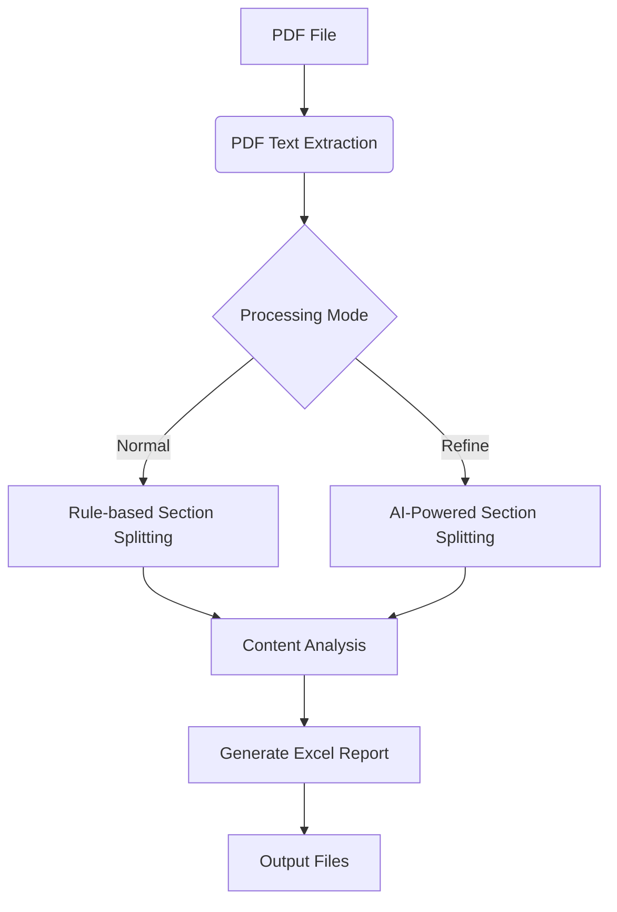

# PDF Parser

An end-to-end PDF processing tool for document analysis and report generation.

## Features
- 📄 PDF text extraction with page-level processing
- 🔍 Intelligent section segmentation (rule-based & AI-powered)
- 🤖 Content analysis using LLM models
- 📊 Excel report generation with customizable formatting
- ⚙️ Configurable processing pipeline (Normal/Refine modes)

## Installation
```bash
git clone https://github.com/yourusername/pdf_parser.git  # Update with your actual repo URL
cd pdf_parser
pip install -r requirements.txt
```

## Usage
```bash
python pdf_parser.py [PDF_FILE_PATH]
```

### Basic Example
```bash
python pdf_parser.py "documents/EU 2021-646.pdf"
```

## Configuration
1. Edit `config.json` to customize settings:
```json
{
  "llm": {
    "base_url": "llm-api.example.com",
    "model_id": "deepseek-llm", 
    "api_key": "your_api_key_here"
  },
  "general": {
    "mode": "Normal"
  }
}
```

## Processing Pipeline



### Mode Comparison
| Feature              | Normal Mode         | Refine Mode          |
|----------------------|---------------------|----------------------|
| Processing Speed     | Fast                | Slower               |
| Accuracy             | Good                | Excellent            |
| Resource Usage       | Low                 | High                 |
| Best For             | Structured Documents| Complex Layouts      |

## Project Structure
```
pdf_parser/
├── pdf_parser.py       # Main entry point
├── config.json         # Configuration settings
├── requirements.txt    # Dependencies
├── func/               # Processing modules
│   ├── content_analyzer.py    # LLM analysis
│   ├── section_splitter.py    # Rule-based splitting 
│   ├── section_splitter_ai.py # AI-powered splitting
│   └── write_to_excel.py      # Report generation
└── log/                # Processing logs
```

## Advanced Usage
```python
from func.section_splitter_ai import AISectionSplitter

# Custom AI model integration
splitter = AISectionSplitter(
    model_endpoint="your_custom_llm_endpoint",
    api_key="your_api_key"
)
sections = splitter.process(pdf_text)
```

## FAQ
**Q: How to handle encrypted PDFs?**  
A: Currently supports only non-encrypted PDF files

**Q: Maximum file size supported?**  
A: Tested with files up to 200 pages (50MB)

**Q: Custom output formats?**  
A: Extend `write_to_excel.py` or create new writers

## Requirements
- Python 3.8+
- See [requirements.txt](requirements.txt) for dependencies

## License
MIT License - See [LICENSE](LICENSE) file for details

## Contributing
1. Fork the repository
2. Create your feature branch (`git checkout -b feature/your-feature`)
3. Commit your changes (`git commit -am 'Add some feature'`)
4. Push to the branch (`git push origin feature/your-feature`)
5. Open a Pull Request

## Support
For issues or questions, please [open an issue](https://github.com/yourusername/pdf_parser/issues)
